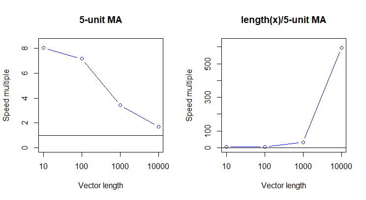
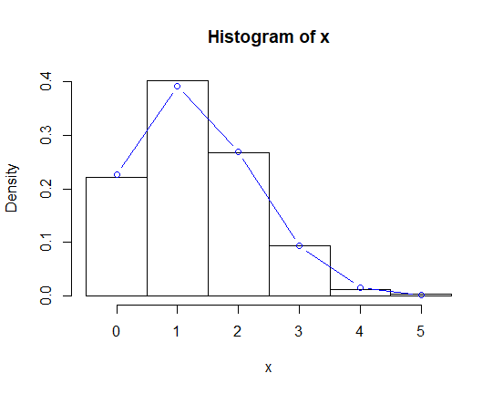
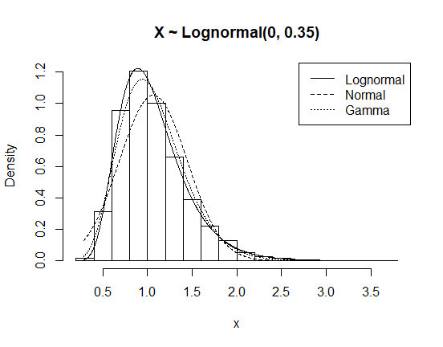

Convenience Functions, Moving Window Statistics, and Graphics
================
Dane Van Domelen <br> <vandomed@gmail.com>
2018-03-21

<!-- README.md is generated from README.Rmd. Please edit that file -->
Introduction
------------

This package contains:

1.  Functions that do something convenient.

2.  Functions for calculating moving-window statistics.

3.  Functions for generating graphs.

Convenience functions
---------------------

### truerange

The base R function *range* returns the minimum and maximum of a vector, but the "range" is actually defined as the difference between the minimum and maximum. This function calculates the actual range. It is equivalent to the base R code `diff(range(x))`, but a bit simpler and much faster.

``` r
x <- rnorm(1000)
all.equal(diff(range(x)), truerange(x))
#> [1] TRUE
as.data.frame(print(microbenchmark(diff(range(x)), truerange(x), times = 500)))
#> Unit: microseconds
#>            expr    min     lq      mean  median     uq    max neval
#>  diff(range(x)) 18.158 19.737 21.795814 20.7245 22.501 78.948   500
#>    truerange(x)  2.763  3.553  4.531534  4.3430  4.738 86.844   500
```

| expr           |     min|      lq|       mean|   median|      uq|     max|  neval|
|:---------------|-------:|-------:|----------:|--------:|-------:|-------:|------:|
| diff(range(x)) |  18.158|  19.737|  21.795814|  20.7245|  22.501|  78.948|    500|
| truerange(x)   |   2.763|   3.553|   4.531534|   4.3430|   4.738|  86.844|    500|

### bmi3, bmi4

It isn't hard to create body mass index (BMI) groups from continuous BMI values, but it is hard to remember how BMI values on the cutpoints get classified. The cutpoints according to the [CDC](https://www.cdc.gov/healthyweight/assessing/bmi/adult_bmi/index.html) are:

| BMI values  | Classification |
|-------------|----------------|
| &lt; 18.5   | Underweight    |
| \[18.5, 25) | Normal weight  |
| \[25, 30)   | Overweight     |
| &gt;= 30    | Obese          |

The function *bmi3* creates 3 groups (lumping the first two above into "Normal weight"), while *bmi4* creates 4 groups. Both return factor variables, with or without labels depending on `labels`.

``` r
bmi <- round(runif(100, min = 15, max = 45), 1)
table(bmi3(bmi))
```

|  Normal weight|  Overweight|  Obese|
|--------------:|-----------:|------:|
|             27|          22|     51|

``` r
table(bmi4(bmi, labels = FALSE))
```

|  \[-Inf,18.5)|  \[18.5,25)|  \[25,30)|  \[30, Inf)|
|-------------:|-----------:|---------:|-----------:|
|            13|          14|        22|          51|

### sumsim

This function creates tables summarizing results of statistical simulations, providing common metrics of performance like mean bias, standard deviation, mean standard error, mean squared error, and confidence interval coverage.

To illustrate, suppose *X*<sub>1</sub>, ..., *X*<sub>*n*</sub> ∼ *N*(*μ*, *σ*<sup>2</sup>), and we wish to compare two estimators for *σ*<sup>2</sup>: the MLE (*n* in denominator) vs. the sample variance (*n* − 1 in denominator).

``` r
MLE <- c()
s2 <- c()
for (ii in 1: 1000) {
   x <- rnorm(n = 25)
   MLE[ii] <- sum((x - mean(x))^2) / 25
   s2[ii] <- sum((x - mean(x))^2) / 24
 }
kable(sumsim(estimates = cbind(MLE, s2), truth = 1))
```

|     |  Mean Bias|     SD|    MSE|
|-----|----------:|------:|------:|
| MLE |     -0.036|  0.277|  0.078|
| s2  |      0.004|  0.289|  0.083|

You can request different performance metrics through the `statistics` input; some of them, like confidence interval coverage, require specifying `ses` with standard errors.

Moving window statistics
------------------------

### moving\_mean

The function *moving\_mean* is one of dozens of moving average functions available in R. I'm not sure it's the absolute fastest, but it is much faster than *roll\_mean* in **RcppRoll**.

``` r
library("RcppRoll")

lengths <- c(10, 100, 1000, 10000)
multiples1 <- multiples2 <- c()
for (ii in 1: 4) {
  n <- lengths[ii]
  x <- rnorm(n)
  medians <- summary(microbenchmark(roll_mean(x, 5), moving_mean(x, 5),
                                    roll_mean(x, n / 5), moving_mean(x, n / 5),
                                    times = 50))$median
  multiples1[ii] <- medians[1] / medians[2]
  multiples2[ii] <- medians[3] / medians[4]
}
par(mfrow = c(1, 2))
plot(1: 4, multiples1, type = "b", col = "blue", main = "5-unit MA", 
     ylab = "Speed multiple", xlab = "Vector length", xaxt = "n", 
     ylim = c(0, max(multiples1) * 1.05))
axis(side = 1, at = 1: 4, labels = lengths)
abline(h = 1)

plot(1: 4, multiples2, type = "b", col = "blue", main = "length(x)/5-unit MA", 
     ylab = "Speed multiple", xlab = "Vector length", xaxt = "n", 
     ylim = c(0, max(multiples2) * 1.05))
axis(side = 1, at = 1: 4, labels = lengths)
abline(h = 1)
```



Graphics
--------

### histo

This function is similar to the base R function `hist`, but with two added features:

1.  Can overlay one or more fitted probability density/mass functions (PDFs/PMFs) for any univariate distribution supported in R (see `?Distributions`).

2.  Can generate more of a barplot type histogram, where each possible value gets its own bin centered over its value (useful for discrete variables with not too many possible values).

Here are two examples:

``` r
# Histogram for 1,000 values from Bin(8, 0.25)
x <- rbinom(n = 1000, size = 5, prob = 0.25)
histo(x, dis = "binom", size = 5, colors = "blue", points_list = list(type = "b"))
```



``` r

# Histogram for 10,000 values from lognormal(0, 0.35) and various fitted PDFs.
x <- rlnorm(n = 10000, meanlog = 0, sdlog = 0.35)
histo(x, c("lnorm", "norm", "gamma"), main = "X ~ Lognormal(0, 0.35)")
```



References
----------

Eddelbuettel, Dirk. 2013. *Seamless R and C++ Integration with Rcpp*. New York: Springer. doi:[10.1007/978-1-4614-6868-4](https://doi.org/10.1007/978-1-4614-6868-4).

Eddelbuettel, Dirk, and James Joseph Balamuta. 2017. “Extending extitR with extitC++: A Brief Introduction to extitRcpp.” *PeerJ Preprints* 5 (August): e3188v1. doi:[10.7287/peerj.preprints.3188v1](https://doi.org/10.7287/peerj.preprints.3188v1).

Eddelbuettel, Dirk, and Romain François. 2011. “Rcpp: Seamless R and C++ Integration.” *Journal of Statistical Software* 40 (8): 1–18. doi:[10.18637/jss.v040.i08](https://doi.org/10.18637/jss.v040.i08).

Ushey, Kevin. 2015. *RcppRoll: Efficient Rolling / Windowed Operations*. <https://CRAN.R-project.org/package=RcppRoll>.

Xie, Yihui. 2017. *Printr: Automatically Print R Objects to Appropriate Formats According to the ’Knitr’ Output Format*. <https://CRAN.R-project.org/package=printr>.
